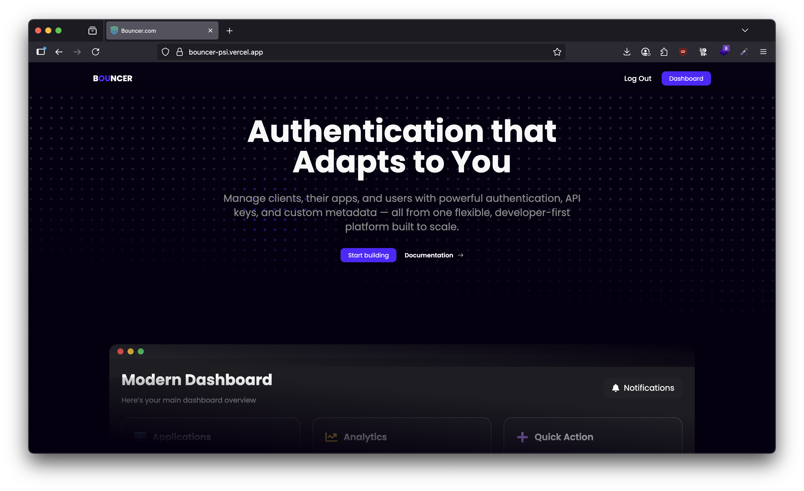
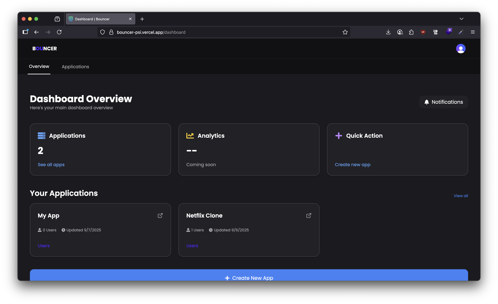
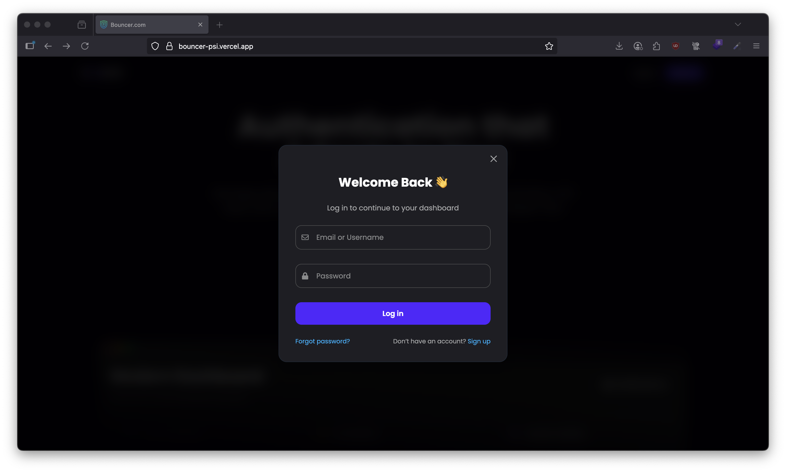
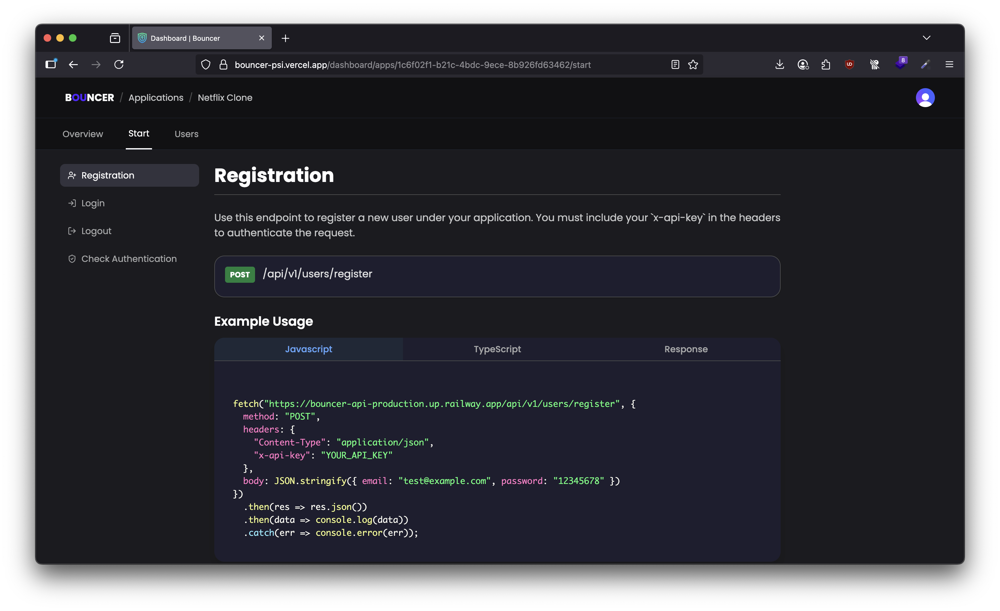

# Bouncer – AaaS Console

**Backend Repository:** [github.com/sudoMakeMeCoffee/bouncer-api](https://github.com/sudoMakeMeCoffee/bouncer-api)  
**Live Demo:** [bouncer-psi.vercel.app](https://bouncer-psi.vercel.app)  

The **Bouncer Authentication-as-a-Service (AaaS) Console** is the **frontend client** for managing apps, API keys, and authentication flows. This repository contains the **UI, layouts, pages, and API client** that power the admin experience.  

  

---

## 🌐 About the Project  

Bouncer provides **Authentication-as-a-Service (AaaS)** for developers who want to integrate authentication without building it from scratch.  

With Bouncer, developers can:  
- **Register applications** and obtain API keys  
- **Authenticate users** within their applications  
- **Manage tokens** (issue, validate, and revoke)  
- **Leverage the console** to manage apps and track activity  

### 🔑 Key Features  

- **App Registration**: Create and manage apps directly in the console  
- **API Key Management**: Securely provision unique keys for each app  
- **Authentication Flows** (via API):  
  - Register new users  
  - Log in and obtain access tokens  
  - Log out and revoke sessions  
  - Verify authentication state  
- **Dashboard Console**: Manage apps, users, and monitor API usage  
- **Frontend Architecture**:  
  - React SPA  
  - Layout-driven pages (Dashboard / Public / Auth)  
  - Tailwind + custom CSS styling  
  - Reusable components for scalability  

---

## 📂 Quick Links  

- Root manifest: [public/index.html](public/index.html)  
- App entry: [src/index.js](src/index.js)  
- Main component: [src/App.js](src/App.js)  
- Dashboard layout: [src/layouts/DashboardLayout.jsx](src/layouts/DashboardLayout.jsx)  
- Public layout: [src/layouts/PublicLayout.jsx](src/layouts/PublicLayout.jsx)  
- API helper: [src/api/axios.js](src/api/axios.js)  
- Scripts & dependencies: [package.json](package.json)  
- Documentation: [README.md](README.md)  

---

## 📸 Screenshots  

- **Dashboard**  
    

- **Login**  
    

- **Docs**  
    

---

## 🚀 Getting Started (Development)  

1. Install dependencies  
   ```bash
   npm install
   ```  

2. Start the development server  
   ```bash
   npm start
   ```  

3. Open your browser at [http://localhost:3000](http://localhost:3000).  

---

## 🛠 Development Commands  

- `npm start` – Run in development mode  
- `npm test` – Launch test runner in watch mode  
- `npm run build` – Build for production  
